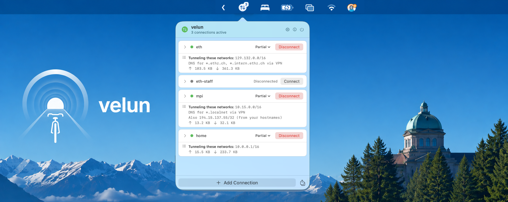

# velun

[Download the app here!](https://apps.manueldeprada.com/velun/download.php)

A native macOS VPN client that speaks AnyConnect (Cisco), Fortinet, GlobalProtect (Palo Alto), and WireGuard.
- Partial and full-tunnel profiles, with automatic internal IPs detection (meaning: use the VPN only for internal servers, not your full traffic!).
- 2FA automation: no need to copy/paste your Authenticator code on every connection.
- Automatic reconnection and launch at login.
- Run multiple profiles from different vendors at the same time, with correct routing and DNS resolution for each. Send traffic between them thanks to the partial tunnel support.
- Implemented in Swift in native NetworkExtension APIs. Integrates with macOS, shows up in Settings > VPNs.

## Technical details

- **One system extension, many tunnels.** Every profile activates the same extension instance; no per-profile VPN configuration proliferation, no extra admin-password prompts after the first install.
- **Automatic partial tunnel detection.** Turn on partial routing and leave the CIDR list blank: velun derives a sensible route list from the server's own hints, with RFC1918 awareness so your home network doesn't get swept up by mistake.
- **Kill switch functionality.** A full-tunnel profile fails closed if the tunnel drops, useful to ensure no leaks of sensitive traffic.
- **Live routing hot-switch.** Flip a connected profile between full and partial without dropping the session or re-authenticating.
- **Scriptable.** A `velun://` URL scheme drives connect/disconnect/import from the terminal or other tools, and profiles can save one-off shell commands that run through a scoped, ephemeral tunnel (no system-wide routing change) for things like `ssh`-ing into a single host.

## Building from source

velun's PacketTunnel component is a macOS system extension, which Apple requires to be signed with a `Developer ID Application` certificate under a paid Apple Developer Program membership. The free "Apple Development" signing identity Xcode uses by default does not work for system extensions, maybe disabling SIP works.

Requirements:

- An Apple Developer Program membership and a Developer ID Application certificate.
- Two manually-created provisioning profiles (from developer.apple.com, not Xcode-managed) granting the `packet-tunnel-provider-systemextension` entitlement to bundle identifiers you control.
- Updating the bundle identifiers, entitlements, app group, and keychain access group throughout the project to match your own account: you can't reuse ours.
- Getting Hardened Runtime and timestamped code signing right on both targets, or `sysextd` and the notarization service will reject the build with unhelpful errors.
- Notarizing the result (`xcrun notarytool` + `stapler`).

Once that's all in place, open `velun.xcodeproj` and build the `velun` scheme, the PacketTunnel extension is a separate target that gets embedded into the app bundle automatically. There's a `tests/` directory with protocol-level unit tests (auth parsing, packet framing, the userspace TCP state machine) you can compile with `swiftc`.

## Pricing

velun is free to use, but if it's useful to you, a license
supports continued development and the Apple Developer Program cost.

You can [buy a license here.](https://store.manueldeprada.com/velun/buy.php)

## Privacy

A random per-install ID is generated locally to count unique installations. It can't be linked to you, and no other telemetry is collected or sent anywhere.
